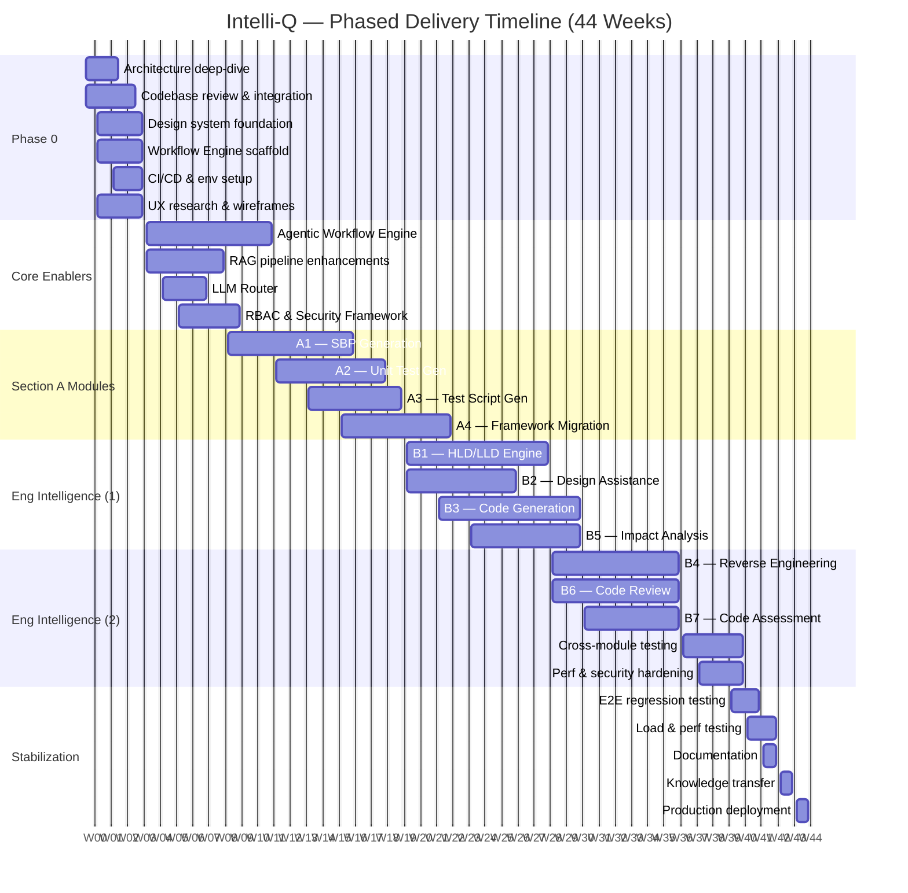

# Intelli-Q — Phased Delivery Timeline
### Altysys → Nomiso | Strategic Development Partnership

---

> **Total Duration:** ~44 weeks (9–12 months)
> **Total Effort:** 995–1,329 person-days
> **Team Size:** ~9.5 FTEs (core) + extended support
> **Approach:** Overlapping phases with parallel workstreams to maximize throughput

---

## Timeline at a Glance

### Phase Summary

| Phase | Name | Weeks | Duration |
|:-----:|------|:-----:|:--------:|
| **0** | Discovery & Foundation | 1–4 | 4 weeks |
| **1** | Core Enablers + Section A | 5–20 | 16 weeks |
| **2** | Engineering Intelligence (Part 1) | 16–30 | 15 weeks |
| **3** | Engineering Intelligence (Part 2) | 26–40 | 15 weeks |
| **4** | Stabilization & Handover | 38–44 | 7 weeks |

> Phases 1↔2 overlap by ~4 weeks. Phases 2↔3 overlap by ~4 weeks. Phases 3↔4 overlap by ~2 weeks.
> As modules in one phase stabilize, the team pivots capacity to the next — keeping utilization high and compressing the overall timeline.

---

## Phase 0 — Discovery & Foundation

**Weeks 1–4** · 4 weeks

> Establish shared understanding of the existing Intelli-Q architecture, align on technical decisions, and build the foundational infrastructure that all subsequent modules depend on.

| Workstream | Activities | Key Deliverables |
|---|---|---|
| **Architecture Deep-Dive** | Codebase walkthrough with Nomiso engineering; review existing RAG pipeline, JIRA integration, test generation engines; identify extension points | Architecture assessment report; integration plan |
| **Design System Foundation** | Audit existing UI; establish token-based design system (spacing, typography, color); build shared React component library scaffold | Design tokens; Storybook instance; core component specs |
| **Platform Scaffolding** | Agentic Workflow Engine skeleton; LLM Router abstraction layer; validation pipeline framework | Deployable scaffold with sample agent registration |
| **Infrastructure Setup** | CI/CD pipelines (build → test → scan → deploy); staging environment provisioning; monitoring dashboards | Fully operational CI/CD; staging environment; App Insights dashboards |
| **UX Research** | Module-level wireframes for all 11 modules; user journey mapping; pattern library definition | Wireframe deck; UX pattern catalog |

**Exit Criteria:**
- [ ] Architecture decision records (ADRs) documented and approved by both teams
- [ ] CI/CD pipeline deploying to staging successfully
- [ ] Design system Storybook published with base components
- [ ] Wireframes for Phase 1 modules reviewed and signed off
- [ ] Agentic Workflow Engine scaffold running with a sample agent

---

## Phase 1 — Core Enablers + Section A

**Weeks 5–20** · 16 weeks

> Deliver the shared AI platform infrastructure (Agentic Workflow Engine, RAG enhancements) alongside the four Section A modules. These modules are workflow-layer enhancements to existing Intelli-Q capabilities.

### Platform Enablers (Weeks 5–12)

| Component | Effort | Description |
|---|:---:|---|
| Agentic Workflow Engine | 30–40 days | Production-ready DAG-based multi-agent orchestration; agent registration, chaining, parallel execution, human-in-the-loop gateway |
| LLM Router | 10–15 days | Multi-provider abstraction (Azure OpenAI, Anthropic, open-source); cost-aware routing; fallback chains; token budget management |
| RAG Pipeline Enhancements | 10–15 days | Hierarchical chunking; hybrid search (vector + BM25); contextual re-ranking; freshness scoring |
| RBAC & Security Framework | 15–20 days | Module/project/action-level permissions; audit logging; prompt security |

### Module Delivery

#### A1: SBP (Solution Blueprint) Generation Screens
**80–110 person-days**

| Layer | Effort | Scope |
|---|:---:|---|
| Discovery & UX | 10–15 days | Multi-step wizard design, schema editor, export flows |
| Backend | 15–20 days | SBP data model, API endpoints, version control service |
| AI Agent | 20–25 days | Blueprint generation agent, RAG context retrieval, validation pipeline |
| Frontend | 20–25 days | Wizard UI, editable schema sections, diagram viewer, export (PDF/DOCX/API) |
| Approval Workflow | 5–10 days | Audit trail, multi-step approval, version comparison |
| Testing & QA | 10–15 days | Unit, integration, E2E, AI output quality validation |

---

#### A2: Unit Test Case Generation Screens
**76–100 person-days**

| Layer | Effort | Scope |
|---|:---:|---|
| Discovery & UX | 8–10 days | Developer-centric split-pane interface design |
| Backend | 15–20 days | Code ingestion pipeline, framework selection service, coverage estimation API |
| AI Agent | 20–25 days | Unit test generation (multi-language), traceability mapping to methods/classes |
| Frontend | 15–20 days | Code upload, split-pane editor, coverage preview, framework selector |
| Integration | 8–10 days | CI/CD trigger capability, repository push integration |
| Testing & QA | 10–15 days | Coverage gap validation, framework compatibility testing |

---

#### A3: Test Script Generation Interface
**68–93 person-days**

| Layer | Effort | Scope |
|---|:---:|---|
| Discovery & UX | 8–10 days | Script preview layout, framework selection UX |
| Backend | 10–15 days | Framework selection engine, environment config, regression tagging |
| AI Agent | 15–20 days | Selenium/Appium/Hybrid script generation, refactoring suggestions |
| Frontend | 15–20 days | Syntax-highlighted preview, cross-browser/device panel, modularization UI |
| Migration Tooling | 10–15 days | Legacy → modern framework assistance |
| Testing & QA | 10–13 days | Cross-framework validation, script execution testing |

---

#### A4: Test Framework Migration Engine
**83–105 person-days**

| Layer | Effort | Scope |
|---|:---:|---|
| Discovery & UX | 8–10 days | Migration wizard, risk dashboard wireframes |
| Backend | 20–25 days | Code parsing engine, dependency mapper, framework comparison matrix |
| AI Agent | 25–30 days | Migration suggestions, automated transformation, risk scoring |
| Frontend | 15–20 days | Analysis dashboard, transformation preview, rollback guidance |
| Testing & QA | 15–20 days | Heavy — migration correctness validation, rollback testing |

---

**Phase 1 Exit Criteria:**
- [ ] Agentic Workflow Engine in production with agents registered for all Section A modules
- [ ] RAG pipeline processing enterprise documents with hybrid search
- [ ] All 4 Section A modules deployed to staging with Nomiso PO acceptance
- [ ] ≥ 80% unit test coverage on new code
- [ ] Security scan clean; audit logging operational

---

## Phase 2 — Engineering Intelligence (Part 1)

**Weeks 16–30** · 15 weeks · *Overlaps Phase 1 by ~4 weeks*

> The first wave of Engineering Intelligence modules — focused on design generation, code generation, and impact analysis. These represent the deepest AI complexity in the entire engagement.

#### B1: HLD/LLD Generation Engine
**90–123 person-days**

| Layer | Effort | Scope |
|---|:---:|---|
| Discovery & UX | 10–15 days | Document structure design, diagram generation approach |
| Backend | 20–25 days | HLD/LLD data model, traceability service, diagram rendering engine |
| AI Agent | 25–35 days | Architecture document generation, diagram suggestions (component/sequence/data flow), dependency highlighting |
| Frontend | 20–25 days | Document editor, interactive diagram viewer, traceability sidebar |
| Export | 5–8 days | PDF, DOCX, Confluence publishing |
| Testing & QA | 10–15 days | Diagram accuracy, traceability validation, export fidelity |

---

#### B2: Design Assistance Engine
**68–90 person-days**

| Layer | Effort | Scope |
|---|:---:|---|
| Discovery & KB Curation | 10–15 days | Architecture pattern library, security/performance knowledge base |
| Backend | 15–20 days | Contextual recommendation API, pattern library service |
| AI Agent | 20–25 days | Design co-pilot with contextual awareness, pattern matching, bottleneck detection |
| Frontend | 15–20 days | Contextual sidebar/panel, recommendation cards, interactive design chat |
| Testing & QA | 8–10 days | Recommendation relevance testing, pattern accuracy validation |

---

#### B3: Automated Code Generation
**95–125 person-days**

| Layer | Effort | Scope |
|---|:---:|---|
| Discovery & Templates | 10–15 days | Template framework design, coding standards definition |
| Backend | 20–25 days | Template engine, standards enforcement, multi-language support |
| AI Agent | 30–40 days | Code generation with hallucination mitigation, secure coding compliance, validation layer |
| Frontend | 20–25 days | Requirements-to-code wizard, code editor with AI suggestions, validation panel |
| Testing & QA | 15–20 days | Generated code quality assurance — compilation, security, standards compliance |

---

#### B5: Advanced Code Impact Analysis
**81–105 person-days**

| Layer | Effort | Scope |
|---|:---:|---|
| Discovery & UX | 8–10 days | Impact visualization design, risk dashboard layout |
| Backend | 20–25 days | Code delta detection, dependency graph traversal, regression scope mapper |
| AI Agent | 20–25 days | Impact prediction, risk scoring, targeted test suggestions |
| Frontend | 15–20 days | Impact tree/graph visualization, risk dashboard, test recommendation panel |
| Integration | 8–10 days | PR-triggered analysis (GitHub, Azure DevOps, GitLab) |
| Testing & QA | 10–15 days | Impact prediction accuracy, regression scope validation |

---

**Phase 2 Exit Criteria:**
- [ ] HLD/LLD engine generating architecture documents with diagram output
- [ ] Design Assistance co-pilot functional with pattern recommendations
- [ ] Code generation producing compilable, standards-compliant output
- [ ] Impact analysis triggered from PR events with risk scores
- [ ] All modules integrated with Agentic Workflow Engine and RAG pipeline

---

## Phase 3 — Engineering Intelligence (Part 2)

**Weeks 26–40** · 15 weeks · *Overlaps Phase 2 by ~4 weeks*

> The second wave of Engineering Intelligence — focused on reverse engineering, code review, and assessment integration. Also includes cross-module integration testing and hardening.

#### B4: Code Reverse Engineering
**90–118 person-days**

| Layer | Effort | Scope |
|---|:---:|---|
| Discovery & UX | 10–13 days | Visualization approaches, output format design |
| Backend | 25–35 days | Large codebase parser, API extractor, dependency graph builder |
| AI Agent | 25–30 days | Architecture map generation, technical debt identification, documentation generation |
| Frontend | 20–25 days | Interactive graph visualization, dependency explorer, documentation viewer |
| Testing & QA | 10–15 days | Parser accuracy, graph correctness, documentation quality |

---

#### B6: Automated Code Review
**83–110 person-days**

| Layer | Effort | Scope |
|---|:---:|---|
| Discovery & UX | 8–10 days | Inline annotation UX, review workflow design |
| Backend | 15–20 days | Review rule engine, policy configuration, PR workflow integration |
| AI Agent | 25–30 days | Performance/security/standards analysis, false positive mitigation |
| Frontend | 15–20 days | Inline annotation UI, issue severity panel, human-in-the-loop validation |
| Integration | 10–15 days | GitHub / Azure DevOps / GitLab PR integration |
| Testing & QA | 10–15 days | False positive rate testing, policy enforcement validation |

---

#### B7: Code Assessment Integration
**66–85 person-days**

| Layer | Effort | Scope |
|---|:---:|---|
| Discovery & API Mapping | 8–10 days | SonarQube, Veracode, Checkmarx connector design |
| Backend | 20–25 days | API integration connectors, metric aggregation engine, correlation service |
| AI Agent | 15–20 days | Insight generation, cross-tool correlation, actionable recommendations |
| Frontend | 15–20 days | Unified dashboard, drill-down views, story/test correlation panel |
| Testing & QA | 8–10 days | Connector reliability, metric accuracy, dashboard fidelity |

---

### Cross-Module Hardening (Weeks 34–40)

| Activity | Description |
|---|---|
| **Integration Testing** | End-to-end flows across modules (Story → Design → Code → Test → Review) |
| **Performance Optimization** | Load testing, query optimization, LLM response caching, UI performance profiling |
| **Security Hardening** | Penetration testing, prompt injection testing, RBAC edge cases, encryption verification |
| **Cross-Module Traceability** | Validate artifact lineage across all 11 modules |

**Phase 3 Exit Criteria:**
- [ ] All 11 modules deployed and functional in staging
- [ ] Cross-module traceability working end-to-end
- [ ] Performance benchmarks met (sub-2s UI load, API p95 < 500ms, AI generation < 30s)
- [ ] Security audit passed with no critical/high findings
- [ ] All external tool integrations (JIRA, Git, SonarQube, etc.) verified

---

## Phase 4 — Stabilization & Handover

**Weeks 38–44** · 7 weeks · *Overlaps Phase 3 by ~2 weeks*

> Final hardening, documentation, knowledge transfer, and production deployment support.

| Week | Focus | Activities |
|:---:|---|---|
| **38–39** | Regression Testing | Full end-to-end regression suite execution; bug triage and fix |
| **40–41** | Load & Performance | Production-grade load testing; capacity planning; cost optimization |
| **42** | Documentation | Architecture docs, API docs (OpenAPI), runbooks, operational guides |
| **43** | Knowledge Transfer | Hands-on sessions with Nomiso engineering; recorded walkthroughs; Q&A |
| **44** | Production Deployment | Deployment support; smoke testing; monitoring validation; hypercare handoff |

### Handover Deliverables

| Deliverable | Format |
|---|---|
| Architecture Decision Records (ADRs) | Markdown in repository |
| API Documentation | OpenAPI 3.1 specs + developer portal |
| Operational Runbooks | Markdown + diagrams |
| Design System Documentation | Storybook + Figma library |
| Prompt Engineering Playbook | Markdown — all prompts, validation rules, tuning history |
| Infrastructure-as-Code | Terraform / Bicep templates |
| Test Suite | Automated — unit, integration, E2E, AI quality |
| Monitoring Dashboards | Azure Application Insights + custom dashboards |

**Phase 4 Exit Criteria:**
- [ ] All modules live in production
- [ ] Zero critical/high bugs open
- [ ] Knowledge transfer sessions completed with recorded artifacts
- [ ] Nomiso team independently operating all modules
- [ ] Hypercare period defined and agreed

---

## Key Milestones Summary

| Milestone | Target Week | Deliverable |
|---|:---:|---|
| Architecture & Design Sign-Off | Week 4 | ADRs, wireframes, design system foundation |
| Agentic Workflow Engine — Production Ready | Week 12 | Shared AI orchestration platform |
| Section A Modules — Staging Release | Week 20 | A1, A2, A3, A4 deployed and accepted |
| Engineering Intelligence Part 1 — Staging Release | Week 30 | B1, B2, B3, B5 deployed and accepted |
| Engineering Intelligence Part 2 — Staging Release | Week 40 | B4, B6, B7 deployed; cross-module tested |
| Production Go-Live | Week 44 | Full platform in production with handover complete |

---

## Dependencies & Assumptions

| # | Assumption |
|---|---|
| 1 | Nomiso provides timely access to existing Intelli-Q codebase, APIs, and infrastructure during Phase 0 |
| 2 | A dedicated Product Owner from Nomiso is available for sprint reviews, backlog grooming, and acceptance |
| 3 | Azure OpenAI (or equivalent) enterprise tier is provisioned and available for development from Week 1 |
| 4 | Existing JIRA integration, Knowledge Base, and test generation engines are stable and documented |
| 5 | Design and architecture sign-offs happen within agreed timelines to avoid downstream delays |
| 6 | Third-party tool APIs (SonarQube, Veracode, etc.) are accessible in staging for integration development |

---

*Document prepared by Altysys · February 2026*
