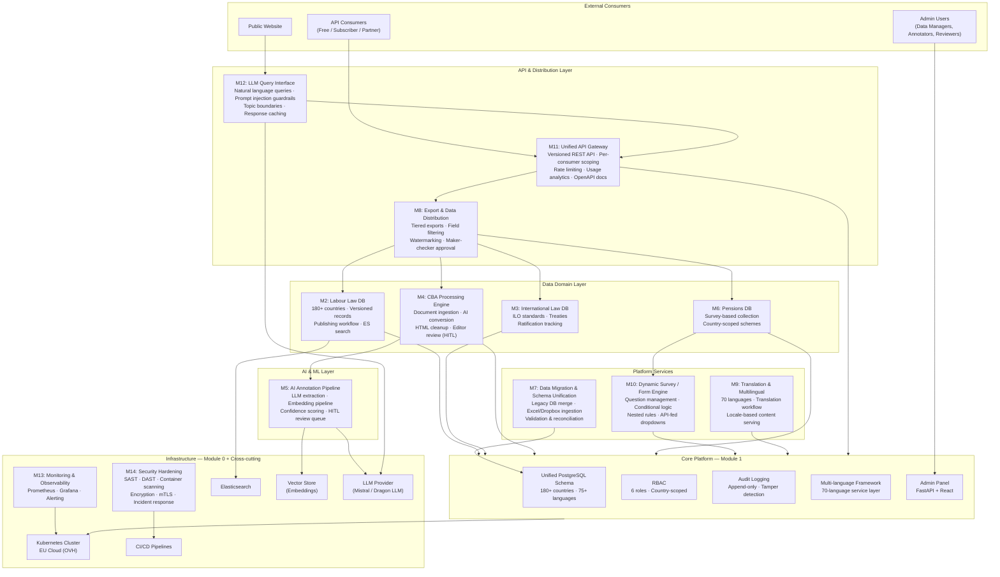

# COBRA 2.0 — Architecture Overview

### Altysys → WageIndicator

---

## System Architecture Diagram



---

## High-Level Summary of Parts

| Layer                  | Modules                                                    | Role                                                                                                                                                                                                                    |
| ---------------------- | ---------------------------------------------------------- | ----------------------------------------------------------------------------------------------------------------------------------------------------------------------------------------------------------------------- |
| **Infrastructure**     | M0 (Discovery), M13 (Monitoring), M14 (Security)           | K8s on EU cloud, CI/CD with security gates, Prometheus/Grafana observability, encryption (TLS 1.3, AES-256, mTLS)                                                                                                      |
| **Core Platform**      | M1                                                         | Single PostgreSQL database unifying 25+ years of legacy data. RBAC with 6 roles, country-scoped access for 180+ countries, append-only audit logging, 70-language framework. Every module depends on this.              |
| **Data Domains**       | M2 (Labour Law), M3 (Int'l Law), M4 (CBA), M6 (Pensions)   | Four distinct content databases — each with structured data entry, versioning, and a Draft → Review → Published workflow. M2/M3 share patterns. M4 adds AI-powered document conversion. M6 uses the survey engine.      |
| **AI/ML**              | M5 (Annotation Pipeline), M12 (LLM Query)                  | M5: LLM-powered field extraction from legal documents with confidence scoring and human-in-the-loop review. M12: Public-facing natural language query API with strict topic boundaries and prompt injection guardrails. |
| **Platform Services**  | M9 (Translation), M10 (Survey Engine), M7 (Data Migration) | M10 is the no-code form builder powering Pensions and future survey databases. M9 manages 70-language content workflows. M7 is the one-time (highest-risk) migration of all legacy sources into the unified schema.     |
| **API & Distribution** | M11 (API Gateway), M8 (Export)                             | Single API surface for all external consumers, with per-consumer scoping, rate limiting, and tiered data exports with statistical watermarking for leak tracing.                                                        |
| **Documentation**      | M15                                                        | Architecture docs, API docs, runbooks, admin guides — produced incrementally and finalized at handover.                                                                                                                 |

---

## Dependency Chain (Critical Path)

```
M0 (Discovery)
 └─► M1 (Core Platform)
      ├─► M2 (Labour Law) ──► M3 (Int'l Law)
      ├─► M4 (CBA Engine) ──► M5 (AI Annotation)
      ├─► M10 (Survey Engine) ──► M6 (Pensions)
      ├─► M11 (API Gateway) ──► M8 (Export)
      │                     ──► M12 (LLM Query)
      ├─► M9 (Translation)
      └─► M7 (Data Migration) [needs M2 + M4 schemas]
```

**Three parallel tracks** emerge after M1 is complete:

1. **Legal Content Track:** M2 → M3, plus M4 → M5
2. **Survey Track:** M10 → M6
3. **API Track:** M11 → M8 + M12

M7 (Data Migration) is the integration seam — it depends on domain schemas from tracks 1 and 2 being finalized before full migration runs.

---

## Key Technology Choices

| Concern               | Choice                                                                    |
| --------------------- | ------------------------------------------------------------------------- |
| **Database**          | PostgreSQL (single unified instance)                                      |
| **Search**            | Elasticsearch (full-text, multilingual, faceted)                          |
| **Backend**           | FastAPI (Python)                                                          |
| **Frontend**          | React (admin panel, form engine, annotation UIs)                          |
| **LLM Providers**     | Mistral / Dragon LLM (EU-compliant; finalized in Discovery)               |
| **Vector Store**      | TBD — for document embeddings in AI pipeline                              |
| **Infrastructure**    | Kubernetes on EU cloud (OVHcloud)                                         |
| **Observability**     | Prometheus + Grafana                                                      |
| **Security Scanning** | SAST, dependency scanning, secret scanning, container scanning, DAST      |
| **Encryption**        | TLS 1.3, AES-256 at rest, mTLS pod-to-pod, pgcrypto for sensitive fields  |
