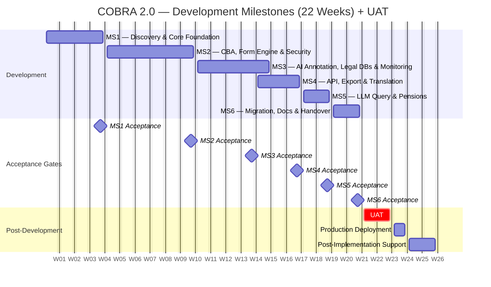

# COBRA 2.0 — Milestone-Based Billing Plan

### Altysys → WageIndicator

---

> **Date:** April 2026
> **Development Effort:** 582 person-days across 22 weeks (6 milestones)
> **QA:** 25% of development effort, distributed across milestones
> **UAT & Go-Live:** Follows after MS6 (not included in milestone development weeks)
> **Billing Model:** Payment triggered on milestone acceptance

---

## Milestone Summary

| # | Milestone | Weeks | Modules | Dev (PD) | % of Dev | Cumulative % |
|:-:|-----------|:-----:|---------|:--------:|:--------:|:------------:|
| 1 | Discovery & Core Foundation | 4 | M0, M1 | **96** | 16% | 16% |
| 2 | Document Processing, Form Engine & Security | 6 | M4, M10, M14 | **134** | 23% | 39% |
| 3 | AI Annotation, Legal Databases & Monitoring | 5 | M5, M2, M3, M13 | **136** | 24% | 63% |
| 4 | API Layer, Export & Translation | 3 | M11, M8, M9 | **101** | 17% | 80% |
| 5 | LLM Query & Pensions | 2 | M12, M6 | **54** | 9% | 89% |
| 6 | Data Migration, Documentation & Handover | 2 | M7, M15 | **61** | 11% | 100% |
| | **Total** | **22** | | **582** | **100%** | |

---

## Milestone Details

---

### Milestone 1 — Discovery & Core Foundation

**Weeks 1–4 · 4 weeks**
**Effort:** 96 person-days
**Modules:** M0 (Discovery & Project Setup), M1 (COBRA Core Platform)

> Discovery runs in weeks 1–2 with a smaller team. Full team ramps in week 2 for core platform build.

**M0 — Discovery & Project Setup (15 PD)**

| Deliverable | Description |
|-------------|-------------|
| Legacy Schema Audit | Documented table structures, row counts, and relationships across all COBRA databases |
| Data Profiling Report | Catalogue legacy data sources (databases, flat files, Dropbox) — schemas, data quality issues, volume assessment |
| Unified Schema Design | Target PostgreSQL ERD, table definitions, normalization decisions, Architecture Decision Record (ADR) |
| Infrastructure Provisioning | K8s cluster, CI/CD pipelines, staging environment on EU cloud (OVH) |
| Dev Environment | Docker Compose setup, seed data scripts, environment templates, onboarding README |
| LLM Evaluation Report | 50 sample documents tested against candidate models; accuracy comparison with recommendation |
| Architecture Sign-Off | Final tech stack confirmation, ADR documentation, team kickoff completed |

**M1 — COBRA Core Platform (81 PD)**

| Deliverable | Description |
|-------------|-------------|
| Unified Database | PostgreSQL schema DDL, SQLAlchemy models, seed data (180+ countries, 75+ languages, currencies, regions), indexing strategy, connection pooling |
| Core Data Models | Country, Language, Industry, Sector, OccupationCode models with base mixins (Timestamp, SoftDelete, CountryScoped, Auditable) |
| Authentication | Registration with email verification, JWT login, forgot/reset password, password policy enforcement, session management |
| Custom RBAC Engine | Permission model (module × action matrix), 6 default role templates, permission-checking middleware, role CRUD API, permission matrix UI, permission-aware frontend rendering |
| Admin Panel Shell | Layout shell (sidebar, header, breadcrumbs), dashboard, user management screens, system settings, reusable UI components |
| Audit Logging | Append-only audit log model, automatic middleware-based capture, CSV export, filterable viewer UI |
| Country-Scoped Access | User-to-country assignment, automatic query filtering, country context switcher, module-scoped permission extension |
| Multi-Language Framework | Translation key registry, 70-language locale management, locale detection middleware, i18n integration, import/export CLI, locale selector UI |
| Notification System | Notification model, email service (async via Celery), in-app notification API, notification center UI, per-event preferences |

---

### Milestone 2 — Document Processing, Form Engine & Security

**Weeks 5–10 · 6 weeks**
**Effort:** 134 person-days
**Modules:** M4 (CBA Processing Engine), M10 (Dynamic Survey / Form Engine), M14 (Security Hardening)

> Longest milestone — CBA engine and form engine run as parallel tracks. Security hardening runs alongside both, embedding CI/CD gates, threat modeling, and encryption before domain modules go live.

**M4 — CBA Processing Engine (51 PD)**

| Deliverable | Description |
|-------------|-------------|
| Document Ingestion | Upload API (PDF) with file validation, virus scanning, drag-and-drop UI, metadata form, file storage abstraction |
| OCR Pipeline | Scanned PDF detection, OCR integration, output normalization |
| AI Document Conversion | PDF→text extraction (multi-column, tables, footnotes), LLM-assisted structure detection |
| Structured Data Extraction | CBA field extraction (parties, dates, industry, coverage), prompt engineering with few-shot examples, output validation |
| HTML Cleanup | Sanitization, heading hierarchy enforcement, table/list normalization, TOC generation |
| Editor Review (HITL) | Review queue with assignment and locking, side-by-side viewer (original PDF ↔ converted HTML), inline rich-text editor, section-level accept/reject, approve/reject workflow |
| CBA Metadata Management | Metadata model and entry form (pre-filled from AI), date pickers, searchable industry dropdowns, validation rules |
| Legacy CBA Migration Scripts | Schema analysis, transformation scripts, file migration, staging reconciliation |

**M10 — Dynamic Survey / Form Engine (63 PD)**

| Deliverable | Description |
|-------------|-------------|
| Question Management | Question model, question set/form grouping, list UI with inline editing, add/edit modal, drag-and-drop reordering, archive/restore |
| Data Type Support | Text, number, date, boolean, single/multi-select dropdowns, radio buttons, checkboxes, free text — with per-type validation |
| Required/Optional Flags | Per-question configuration, conditional required ("required if Q_X = Y"), visual indicators |
| Conditional Visibility | Visual rule builder ("if Q_A = X, show Q_B"), server-side validation, live preview, rule conflict detection |
| Nested Logic | AND/OR grouping with arbitrary nesting, recursive evaluation, visual nested rule builder, depth limits |
| External API Dropdowns | Admin-configurable external API connectors, proxy with caching, dynamic lazy-loaded dropdowns |
| Form Versioning | Version snapshots on publish, impact analysis on collected responses, version history with diff and revert |

**M14 — Security Hardening (20 PD)**

| Deliverable | Description |
|-------------|-------------|
| STRIDE Threat Model | Threat register mapped against architecture; mitigations tracked in backlog |
| CI/CD Security Gates | SAST, dependency scanning, secret scanning |
| Container Scanning | Container image scanning, vulnerability suppression workflow, base image policy |
| DAST | Dynamic application security testing against staging, scan profile tuning, advisory finding triage |
| Encryption | TLS 1.3 enforcement, pgcrypto for sensitive fields, secrets management, backup encryption |
| Incident Response | Runbooks for compromised keys/data leaks/unauthorized access, severity classification |
| Backup & Restore | Automated encrypted backups, documented restore procedure, RTO/RPO validation |

---

### Milestone 3 — AI Annotation, Legal Databases & Monitoring

**Weeks 11–15 · 5 weeks**
**Effort:** 136 person-days
**Modules:** M5 (AI Annotation Pipeline), M2 (Labour Law Database), M3 (International Law Database), M13 (Monitoring & Observability)

> AI annotation depends on the CBA engine from MS2. Labour law and international law can start immediately. Monitoring is stood up alongside the domain modules to observe the first production-like workloads.

**M5 — AI Annotation Pipeline (45 PD)**

| Deliverable | Description |
|-------------|-------------|
| LLM Integration Layer | Single provider API wrapper with retry/timeout, token usage tracking, EU data residency validation |
| Document Embedding | Chunking strategy (semantic boundaries), vector store setup (pgvector), similarity retrieval for context injection |
| LLM-Powered Extraction | Per-document-type prompt templates, few-shot example management, chained extraction pipeline with partial failure handling |
| Confidence Scoring | Per-field confidence computation (LLM self-assessment + heuristics), configurable thresholds (auto-accept/mandatory-review), color-coded UI indicators |
| HITL Review Queue | Queue with assignment and priority, field-level accept/reject UI, batch operations (bulk approve high-confidence), annotation history trail |
| Split-Pane Annotation Screen | Left: document viewer with text selection, color-coded highlights. Right: category tabs, dynamic questions from form engine, AI suggestion icons, per-question search/locate |
| Model Evaluation | Ground truth dataset management, precision/recall/F1 metrics per field/language, evaluation dashboard with trends |

**M2 — Labour Law Database (56 PD)**

| Deliverable | Description |
|-------------|-------------|
| Labour Law Data Models | Category models (min wages, working hours, leave, termination, social security), temporal validity, country-specific field configuration |
| Structured Data Entry UI | Dynamic form renderer, client + server validation, country context switching, draft auto-save, inline help |
| Version-Controlled Records | Full JSON snapshot per save, version history API and table, side-by-side diff, rollback with confirmation |
| Publishing Workflow | Draft → Under Review → Published state machine, role-gated transitions, status transition UI, publishing history log, notification triggers |
| Country-Scoped Management | Country filtering extensions, bulk publish/assign scoped by country |
| Search & Retrieval | PostgreSQL full-text search (tsvector, GIN indexes), search API with filters, search UI with highlighting and pagination |
| Legacy Migration Scripts | ETL from legacy labour law DB, data validation, staging dry-run with reconciliation |

**M3 — International Law Database (20 PD)**

| Deliverable | Description |
|-------------|-------------|
| Content Schema | Models for ILO conventions, treaties, ratification status (country × convention) |
| Data Entry UI | Adapted from Labour Law with international law fields, searchable convention dropdown |
| Cross-Country Ratification View | Matrix: countries × conventions with ratification dates and status |
| Domain Business Rules | Ratification tracking, applicability mapping to national labour law, validation rules |
| Legacy Migration Scripts | Transformation scripts, staging dry-run |

**M13 — Monitoring & Observability (15 PD)**

| Deliverable | Description |
|-------------|-------------|
| Prometheus + Grafana | Metrics collection, default dashboards (system, FastAPI, PostgreSQL, Celery), custom metrics |
| Alerting Rules | Security alerts (403 spikes, login failures), application alerts (error rates, response times), data pipeline alerts |
| Log Aggregation | Structured JSON logging, centralized log stack (Loki), Grafana log dashboards |
| Health Checks & SLA | Per-service health endpoints, uptime tracking, SLA dashboard |

---

### Milestone 4 — API Layer, Export & Translation

**Weeks 16–18 · 3 weeks**
**Effort:** 101 person-days
**Modules:** M11 (Unified API Gateway), M8 (Export & Data Distribution), M9 (Translation & Multilingual)

> All three modules are independent — API gateway, export, and translation run as parallel tracks with full team utilization.

**M11 — Unified API Gateway (26 PD)**

| Deliverable | Description |
|-------------|-------------|
| API Design & Versioning | RESTful API with versioned endpoints (/api/v1/), consistent response envelope, error standardization |
| Per-Consumer Scoping | Consumer model, scope resolution middleware (API key → datasets/countries/actions), automatic queryset filtering |
| Rate Limiting | Tiered limits (free/subscriber/partner), in-memory cache-backed throttle, rate limit headers in responses |
| Usage Analytics | Request logging, daily/weekly/monthly aggregation, consumer usage dashboard, quota monitoring alerts |
| API Documentation | Auto-generated OpenAPI/Swagger spec, hosted Swagger UI at /api/docs/, narrative getting-started guide |

**M8 — Export & Data Distribution (46 PD)**

| Deliverable | Description |
|-------------|-------------|
| Tiered Export Framework | Export profiles per tier, field inclusion/exclusion configuration, CSV/JSON/XLSX output, async job queue |
| Field-Level Filtering | Dynamic serializer resolving API key → tier → included fields, whitelist/blacklist per tier, nested field depth control |
| Aggregation Enforcement | Free-tier aggregation layer (averages, counts, ranges), rule configuration, tier-check middleware |
| Statistical Watermarking | Row-ordering permutation per consumer, watermark embedding on export, leak detection utility |
| Bulk Export Approval | Configurable threshold trigger, approval queue, preview + approve/reject UI, post-approval file generation with expiry |
| API Key Management | Key model (hash, consumer, tier, scopes), lifecycle API (issue/rotate/revoke), admin UI, authentication middleware |
| Rate Limiting & Revocation | Per-consumer rate limits, token bucket with in-memory cache, instant revocation propagation |

**M9 — Translation & Multilingual (29 PD)**

| Deliverable | Description |
|-------------|-------------|
| Language Service Layer | Language-aware content serving API, fallback chain (missing → primary with indicator), availability indicator, content language switcher |
| Multi-Language Content Management | Translation model (base record → translated versions), status tracking, side-by-side editing (original + translation), coverage dashboard |
| Translation Workflow | Translator assignment per language, task queue with prioritization, review & publish translation |

---

### Milestone 5 — LLM Query & Pensions

**Weeks 19–20 · 2 weeks**
**Effort:** 54 person-days
**Modules:** M12 (LLM Query Interface), M6 (Pensions Database)

> Two independent modules in parallel. LLM query builds on the API gateway from MS4. Pensions builds on the form engine from MS2.

**M12 — LLM Query Interface (29 PD)**

| Deliverable | Description |
|-------------|-------------|
| Natural Language Query API | Query endpoint (text + language), RAG pipeline (retrieve → inject context → generate), structured JSON + NL response with source citations |
| Restricted DB Access | Dedicated PostgreSQL role (SELECT-only), schema visibility restriction, read-only connection pool with statement timeout |
| Prompt Injection Guardrails | Input sanitization, output validation (PII/data leakage detection), context window restrictions |
| Topic Boundary Enforcement | Query classifier (in-scope/out-of-scope), admin-configurable approved topics, polite refusal template |
| Access Layer Integration | Auth check (email/SMS registration, subscription tier), tier-based query limits, query UI widget |
| Response Caching | In-memory cache (keyed by normalized query + language + data version), TTL + event-driven invalidation, hit/miss monitoring |

**M6 — Pensions Database (25 PD)**

| Deliverable | Description |
|-------------|-------------|
| Pensions Data Models | Pension schemes, benefit types, eligibility criteria, contribution rates, country-specific variations |
| Survey Integration | Pensions questionnaires wired to form engine, response-to-model data binding, survey rendering in pensions context |
| Country-Scoped Entry | Country context selection, regional pension scheme variations |
| Publishing Workflow | Draft → Review → Published (reusing M2 workflow engine), pensions-specific review rules, notification integration |
| Legacy Migration | Pensions data transformation scripts, staging dry-run |

---

### Milestone 6 — Data Migration, Documentation & Handover

**Weeks 21–22 · 2 weeks**
**Effort:** 61 person-days
**Modules:** M7 (Data Migration & Schema Unification), M15 (Documentation & Handover)

> Per-domain migration scripts are written incrementally as each domain module is built (MS2–MS5). This milestone covers the final full migration run, end-to-end validation, reconciliation sign-off, and documentation finalization.

**M7 — Data Migration & Schema Unification (46 PD)**

| Deliverable | Description |
|-------------|-------------|
| Schema Analysis & Mapping | All source schemas documented, field mapping matrix (source → target), data quality assessment per source |
| Database Unification Scripts | Per-domain migration scripts (CBA, Labour Law, International Law, Pensions), cross-database reference resolution |
| Validation & Reconciliation | Row-count reconciliation (source vs. target per domain), referential integrity checks, data quality scoring, exception queue, validation dashboard |
| Rollback Capability | Staged migration with named checkpoints, pre-migration snapshot automation (pg_dump), rollback script to any checkpoint |
| Migration Reporting | Migration run tracking (jobs, stages, timing, errors), progress dashboard, domain-level sign-off workflow |

**M15 — Documentation & Handover (15 PD)**

| Deliverable | Description |
|-------------|-------------|
| Technical Architecture Docs | System diagrams, data flow diagrams, consolidated ADRs, integration point documentation |
| API Documentation | Final OpenAPI spec, consumer onboarding guide, data dictionary |
| Operational Runbooks | Deployment procedure, rollback procedure, scaling & maintenance guides |
| Admin User Guides | Admin panel walkthrough, form engine configuration guide, export setup guide |

---

## UAT & Go-Live (Post-Development)

> UAT begins after MS6 acceptance. Separate phase outside the 22-week development timeline.

| Phase | Duration | Description |
|-------|:--------:|-------------|
| UAT | 2 weeks | WageIndicator testers exercise all modules; defect triage and fix |
| Production Deployment | 1 week | Production environment deployment, smoke testing, go-live |
| Post-Implementation Support | 2 weeks | Stabilization — production defect resolution, monitoring tuning |

---

## Payment Schedule

| Milestone | Weeks | Dev (PD) | % of Dev | Payment Trigger |
|:---------:|:-----:|:--------:|:--------:|-----------------|
| MS1 | 4 | 96 | 16% | Architecture sign-off + core platform demo — RBAC, auth, admin panel |
| MS2 | 6 | 134 | 23% | CBA end-to-end demo + form engine conditional logic + security scan results |
| MS3 | 5 | 136 | 24% | AI annotation walkthrough + labour law CRUD + international law ratification view + monitoring dashboards live |
| MS4 | 3 | 101 | 17% | API gateway + tiered export + translation workflow live on staging |
| MS5 | 2 | 54 | 9% | LLM query demo on staging + pensions data collection workflow |
| MS6 | 2 | 61 | 11% | Migration reconciliation report accepted + documentation delivered |
| **Total** | **22** | **582** | **100%** | |

> UAT sign-off and production go-live are gated separately — not tied to a development milestone payment.

---

## Milestone Dependency Chain

```
MS1 (Discovery + Core Foundation)
 ├─► MS2 (CBA + Form Engine + Security)
 │    ├─► MS3 (AI Annotation + Legal DBs + Monitoring)
 │    │    └─► MS5 (LLM Query + Pensions)
 │    │         └─► MS6 (Migration + Docs)
 │    └─► MS4 (API + Export + Translation)
 │         └─► MS5 (LLM Query + Pensions)
 └─────────────────► MS6 (Migration + Docs)
```

---

## Milestone Timeline



---

## Notes

1. **QA (25% of development)** runs in parallel within each milestone. Total effort including QA is ~728 PD.
2. **Data migration (M7)** scripts are written incrementally as domain modules are built (MS2–MS5). MS6 covers the final full migration run, reconciliation, and sign-off. Excel/Dropbox ingestion is out of scope for this engagement.
3. **MS4 is high-intensity** (101 PD in 3 weeks) — works because M11, M8, and M9 are independent parallel tracks requiring no cross-module coordination.
4. **MS5 and MS6 are deliberately compact** — both modules build on established infrastructure. Smaller scope = faster verification.
5. **Milestone acceptance** requires a structured demo with WageIndicator stakeholders. Minor defects do not block payment — they're triaged into the next milestone or UAT.
6. **UAT and go-live are outside the 22-week development window.** These are separate from milestone billing.
