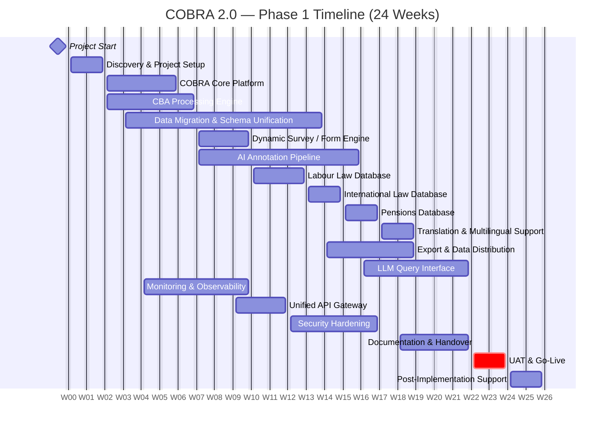

```mermaid
gantt
    title COBRA 2.0 — Phase 1 Timeline (24 Weeks)
    dateFormat YYYY-MM-DD
    axisFormat W%W
    tickInterval 1week
    excludes weekends

    Project Start                          :milestone, ms0, 2025-01-01, 0d
    Discovery & Project Setup              :d0, 2025-01-06, 10d
    COBRA Core Platform                    :c1, 2025-01-20, 20d
    CBA Processing Engine                  :c4, 2025-01-20, 25d
    Data Migration & Schema Unification    :dm, 2025-01-27, 55d
    Dynamic Survey / Form Engine           :f10, 2025-02-24, 15d
    AI Annotation Pipeline                 :a5, 2025-02-24, 45d
    Labour Law Database                    :l2, 2025-03-17, 15d
    International Law Database             :l3, 2025-04-07, 10d
    Pensions Database                      :p6, 2025-04-21, 10d
    Translation & Multilingual Support     :t9, 2025-05-05, 10d
    Export & Data Distribution             :p8, 2025-04-14, 25d
    LLM Query Interface                    :lm, 2025-04-28, 30d
    Monitoring & Observability             :x13, 2025-02-03, 30d
    Unified API Gateway                    :a11, 2025-03-10, 15d
    Security Hardening                     :x14, 2025-03-31, 25d
    Documentation & Handover               :x15, 2025-05-12, 20d
    UAT & Go-Live                          :crit, uat, 2025-06-09, 10d
    Post-Implementation Support            :post, 2025-06-23, 10d
```
