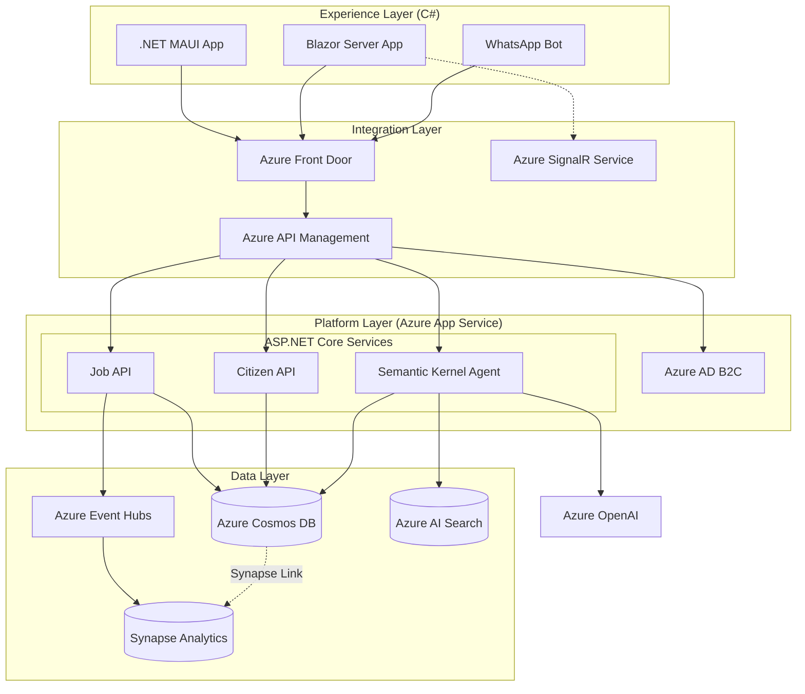

# Tech Stack Recommendation: Microsoft .NET Ecosystem for Advanced LMIS

## Executive Summary
To support the transition from a "Project Portal" to a "National Digital Intelligence Platform," the technology stack leverages the full power of the **Microsoft Ecosystem**.

This recommendation utilizes a **.NET-heavy architecture**, capitalizing on shared C# logic between backend, web, and mobile to maximize developer velocity, while using **Azure Cosmos DB** for planet-scale data resilience and **Blazor** for rich, real-time interactive user experiences.

---

## 1. Data Layer
*Focus: Golden Records, Trust, and Real-Time Analytics*

To achieve the "Information Failure Fix," we utilize a modern, cloud-native data estate that supports both transactional speed and analytical depth without data duplication.

| Component | Recommended Technology | Why this fits the Pitch |
| :--- | :--- | :--- |
| **Operational Database** | **Azure Cosmos DB** (NoSQL API) | A "Planet-Scale" database offering millisecond latency. Essential for handling massive spikes in user traffic (e.g., job fairs) with guaranteed SLAs. |
| **Analytics Engine** | **Azure Synapse Link for Cosmos DB** | Enables **Real-Time Analytics** (HTAP) directly on operational data without complex ETL pipelines. Dashboards reflect live labor market changes instantly. |
| **Master Data Management** | **Microsoft Purview** | Governance and cataloging solution. Scans and classifies data across the government estate to build the trusted "Golden Record" of the citizen. |
| **Data Ingestion** | **Azure Data Factory** | Robust orchestration to pull data from diverse government silos and private portals into the data estate. |
| **Search & Vector Store** | **Azure AI Search** | Native integration with Cosmos DB and Azure OpenAI. Powered by RAG (Retrieval-Augmented Generation) to match skills conceptually (e.g., "Nurse" ≈ "Patient Care"). |

---

## 2. AI & Intelligence Layer
*Focus: Matching, Profiling, and Policy Insight (Native .NET)*

We keep the AI stack integrated within the .NET ecosystem to reduce context switching and simplify deployment.

| Component | Recommended Technology | Why this fits the Pitch |
| :--- | :--- | :--- |
| **AI Orchestration** | **Microsoft Semantic Kernel (C#)** | Allows standard .NET developers to build AI agents. Integrates LLMs directly into the C# codebase for "Co-pilot" features without needing Python teams. |
| **GenAI / LLM Integration** | **Azure OpenAI Service** | Provides the intelligence for **Profiling** (auto-writing resumes) and **Career Guidance** chatbots. Secured within the government's Azure tenant. |
| **Forecasting Models** | **ML.NET** | Cross-platform machine learning framework for .NET. Allows training local forecasting models (e.g., skill demand prediction) directly in C#. |
| **ML Ops** | **Azure Machine Learning** | Enterprise-grade governance, versioning, and monitoring of models to ensure ethical and explainable AI in public service. |

---

## 3. Integration Layer
*Focus: Ecosystem Connectivity*

The "missing link" that connects Education, Welfare, and Private sectors to the platform.

| Component | Recommended Technology | Why this fits the Pitch |
| :--- | :--- | :--- |
| **API Framework** | **ASP.NET Core Web API** | High-performance, cross-platform framework. Known for being one of the fastest web frameworks in the tech benchmark game. |
| **API Gateway** | **Azure API Management** | Securely exposes "Government as a Platform" APIs. Critical for onboarding private job portals and training centers. |
| **Event Bus** | **Azure Event Hubs** | Ingests millions of events per second. Ensures the system is **Event-Driven**: a new job post instantly triggers matching notifications. |
| **Standardization** | **OpenAPI (Swagger) & OData** | Standardizes data access for external partners, allowing them to query datasets flexibly. |

---

## 4. Platform Layer
*Focus: Security, Resilience, and Sovereignty*

Addressing the "Infrastructure & Cloud Readiness" block with a unified .NET hosting model.

| Component | Recommended Technology | Why this fits the Pitch |
| :--- | :--- | :--- |
| **Compute** | **Azure App Service** (Linux) | Fully managed platform optimized for .NET applications. Auto-scales based on demand securely and reliably. |
| **Real-Time Comm.** | **Azure SignalR Service** | The backbone of **Blazor Server**. Maintains persistent connections for millions of users to push live job alerts and updates. |
| **Identity (IAM)** | **Azure AD B2C** | Manages citizen identities at scale. Integrates seamlessly with ASP.NET Core Identity for secure authentication. |
| **Security & WAF** | **Azure Front Door** | Global entry point with built-in Web Application Firewall (WAF) to defend against national-level cyber threats. |
| **Monitoring** | **Application Insights** | Deep integration with .NET for code-level performance monitoring and user behavior tracking. |

---

## 5. Experience Layer
*Focus: Accessibility and Adoption (Shared Codebase)*

Maximizing developer efficiency by sharing business logic between Web and Mobile.

| Component | Recommended Technology | Why this fits the Pitch |
| :--- | :--- | :--- |
| **Web Portal** | **Blazor Server** (.NET 8) | Interactive UI built with C#. Removes the need for complex JavaScript frontends. Delivers SEO-friendly content and rich interactivity. |
| **Mobile App** | **.NET MAUI** | **Multi-platform App UI.** Builds native iOS and Android apps using the same C# codebase and business logic as the web portal. |
| **Omnichannel** | **Azure Communication Services** | Powers SMS, Email, and WhatsApp integration for **Targeted Service Delivery** to citizens without smartphones. |
| **CMS** | **Orchard Core** | Modern, modular, multi-tenant CMS built on ASP.NET Core. Allows non-technical staff to manage portal content. |

---

## Architecture Blueprint (High Level)

## Why This Stack Wins Deals
1.  **Unified Ecosystem:** One language (C#) from database triggers to mobile apps. This reduces cognitive load and allows the team to move extremely fast ("Velocity").
2.  **Cosmos Scale:** We can confidently tell the government, "This system runs on the same database technology that powers Teams and Xbox." It will not crash.
3.  **Real-Time by Default:** With Blazor and Synapse Link, the system isn't just a static registry; it's a live, breathing view of the labor market.

