## Executive Summary

This document proposes a strategic shift in how OpComm manages application configuration across multiple environments. The current approach requires manual creation and maintenance of complete configuration blocks for each environment, making new environment provisioning time-consuming and error-prone. The proposed solution aligns with .NET standards, leverages environment-specific overrides, and enables automated environment provisioning through CI/CD pipelines.

---

## Current State Analysis

### Existing Architecture

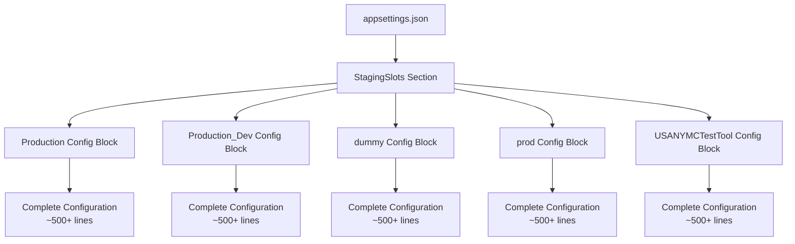

### Current Configuration Flow

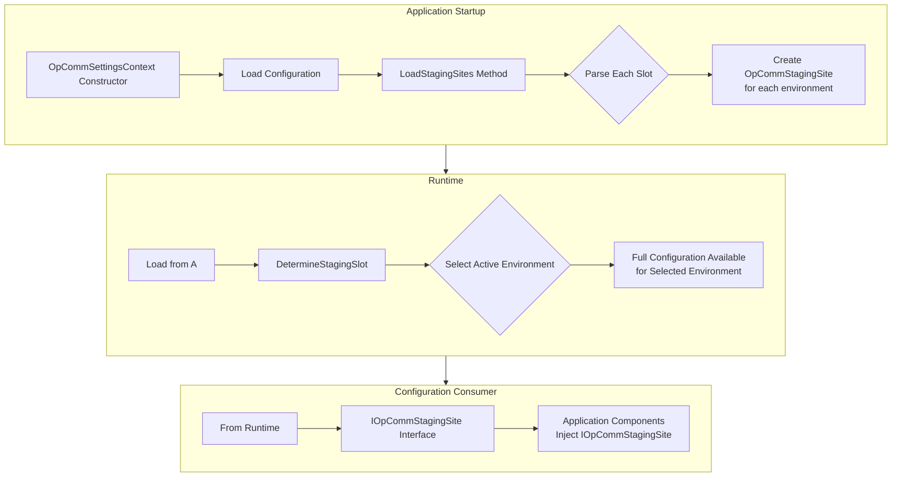

### Problems with Current Approach

1. **High Duplication**: Each environment contains 90%+ identical configuration
2. **Manual Overhead**: Adding a new environment requires copying and modifying ~500 lines of JSON
3. **Maintenance Burden**: Bug fixes or feature additions require changes across all environment blocks
4. **Error Prone**: Copy-paste errors lead to configuration inconsistencies
5. **Version Control Noise**: Small changes result in large diffs across multiple blocks
6. **Non-Standard**: Deviates from .NET configuration conventions

---

## Proposed Architecture

### Phase 1: Environment-Based Override Pattern

The modernized approach follows .NET's standard configuration hierarchy with environment-specific overrides.

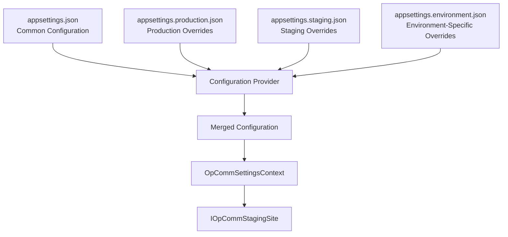

### Configuration Layering Strategy

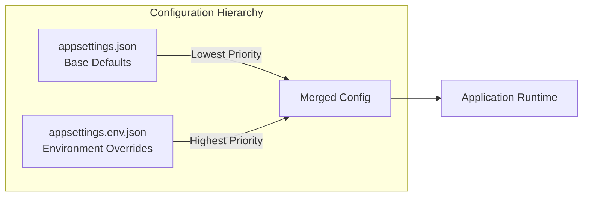

### New Configuration Loading Flow

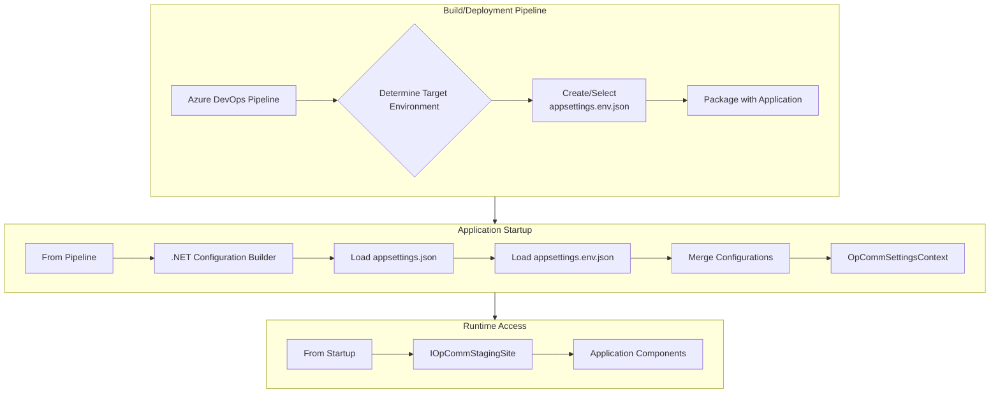

### Configuration Structure Comparison

**Current Approach:**
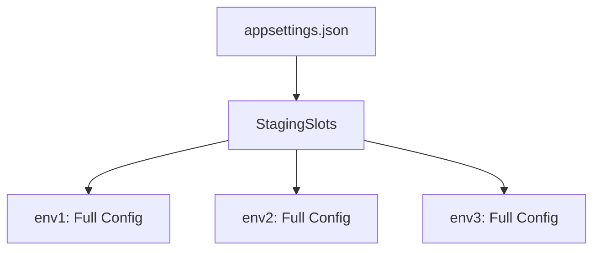

**Proposed Approach:**
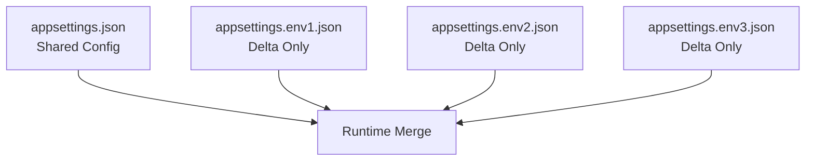

---

## Implementation Details

### File Structure

#### Before (Current)
```
📁 Project Root
└── appsettings.json (contains all environments, ~3000+ lines)
```

#### After (Proposed)
```
📁 Project Root
├── appsettings.json (common configuration, ~400 lines)
├── appsettings.production.json (overrides only, ~50 lines)
├── appsettings.staging.json (overrides only, ~50 lines)
├── appsettings.dummy.json (overrides only, ~50 lines)
├── appsettings.prod.json (overrides only, ~50 lines)
└── appsettings.usanymctesttool.json (overrides only, ~50 lines)
```

### Configuration Content Split

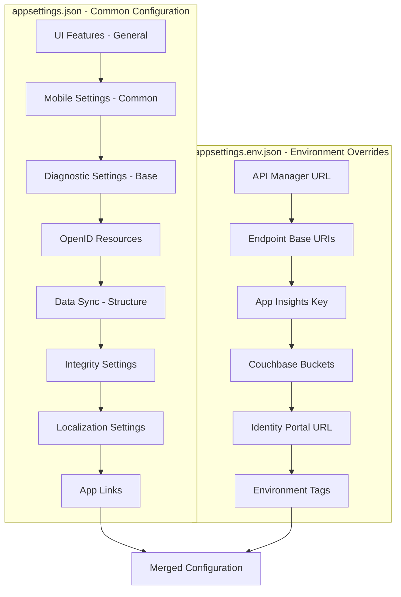

### Code Simplification

#### Current Code Path

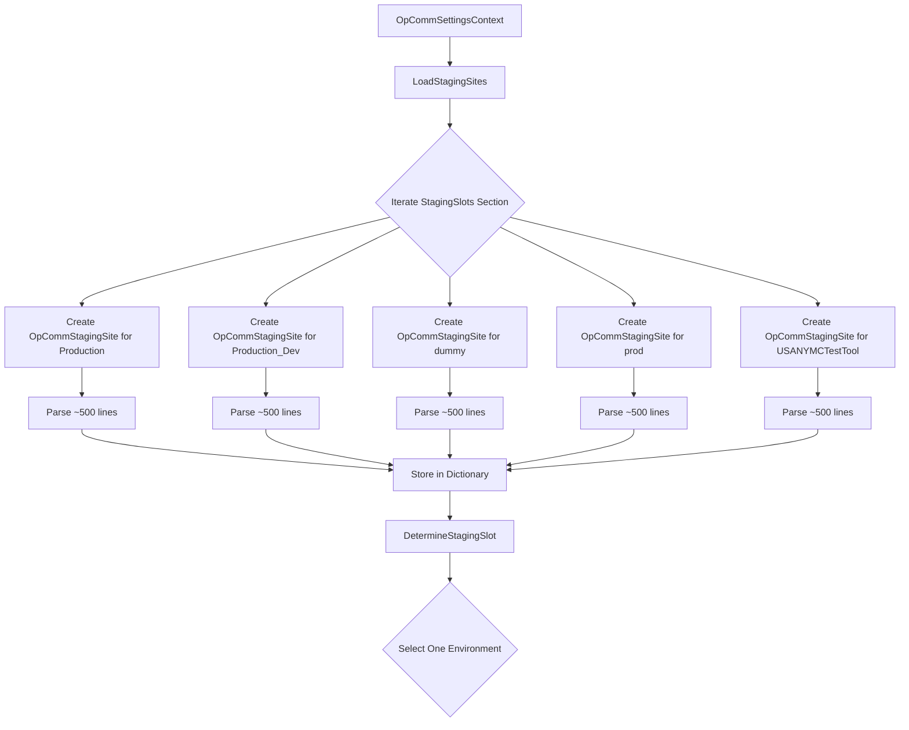

#### Proposed Code Path

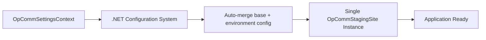

---

## Phase 1 Implementation Approach

### Configuration Provider Pattern

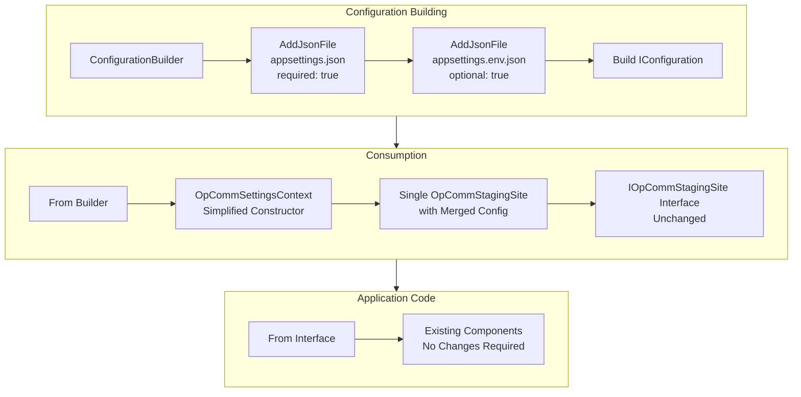

### Component Impact Assessment

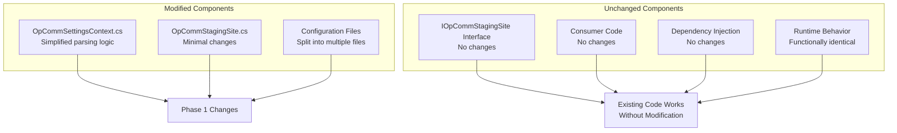

---

## Deployment Automation Integration

### Environment Provisioning Flow

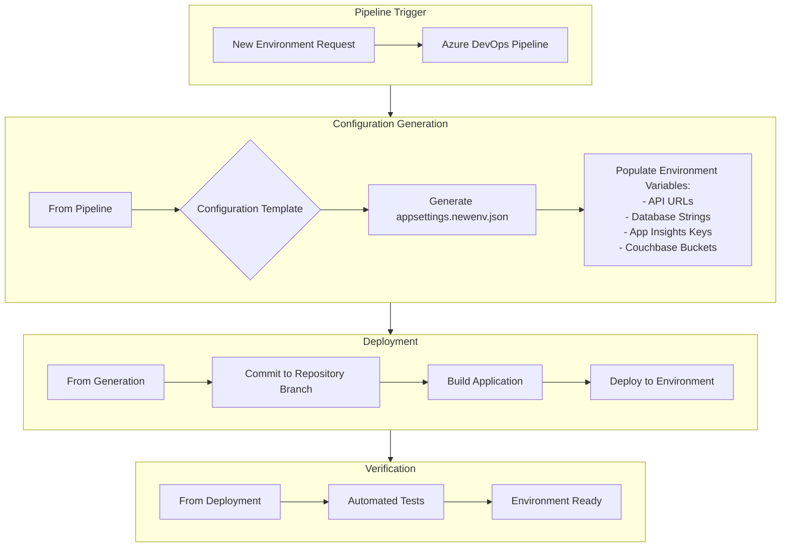

### Pipeline Configuration Template

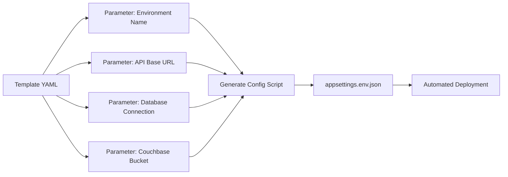

---

## Phase 2: Centralized Configuration API (Future)

### Architecture Vision

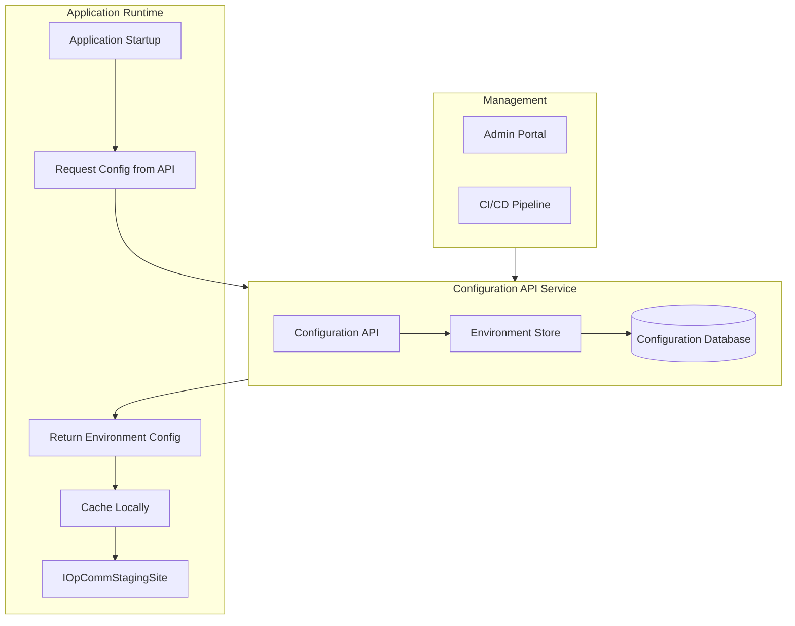

### Benefits of Phase 2
- Centralized configuration management
- Dynamic configuration updates without redeployment
- Audit trail for configuration changes
- Role-based access control for configuration
- A/B testing and feature flags support

---

## Benefits Summary

### Quantitative Benefits

| Metric | Current | Proposed | Improvement |
|--------|---------|----------|-------------|
| Lines per environment | ~500 | ~50 | **90% reduction** |
| Total config file size | ~3000 lines | ~650 lines | **78% reduction** |
| Time to add environment | 30-60 min | 5-10 min | **83% reduction** |
| Configuration parsing complexity | Parse 5 full configs | Parse 1 merged config | **80% reduction** |
| Code complexity (LoadStagingSites) | ~150 lines | ~30 lines | **80% reduction** |

### Qualitative Benefits

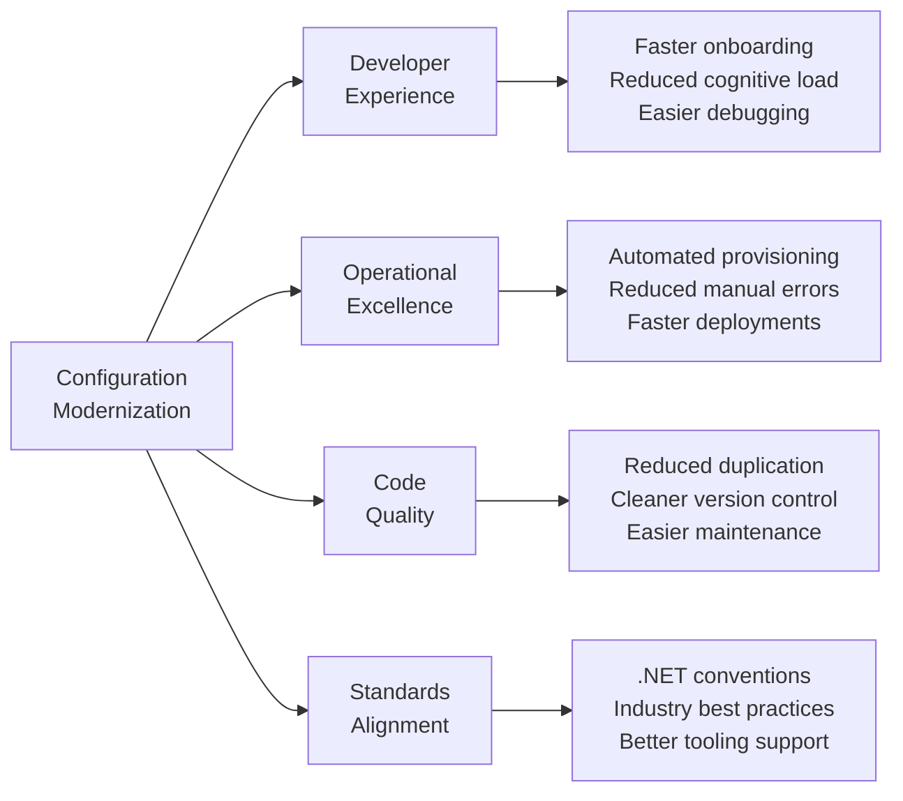

---

## Risk Assessment

### Technical Risks

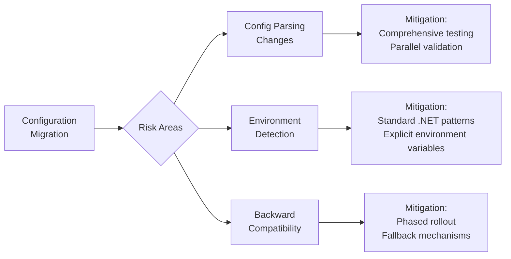

| Risk | Impact | Probability | Mitigation Strategy |
|------|--------|-------------|---------------------|
| Configuration merge errors | Medium | Low | Automated validation tests, schema validation |
| Missing environment overrides | Low | Low | Validation scripts, CI/CD checks |
| Runtime environment detection failure | High | Very Low | Explicit environment configuration, fallback logic |
| Team adoption resistance | Medium | Low | Clear documentation, training, gradual rollout |

---

## Success Criteria

### Phase 1 Completion Metrics

1. All environments using override pattern
2. Configuration file size reduced by >75%
3. New environment provisioning automated in pipeline
4. Zero functional regressions in existing features
5. All tests passing with new configuration structure
6. Documentation updated for new approach

### Validation Approach

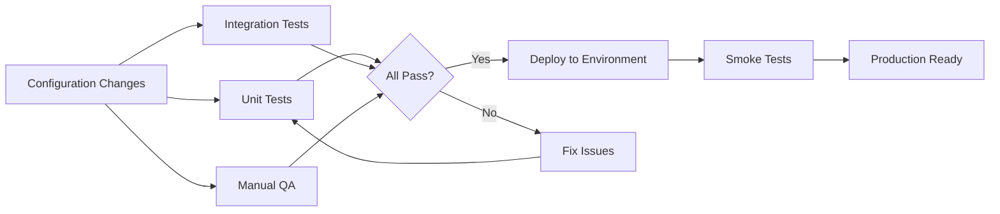

---

## Recommendation

We recommend **approving Phase 1 implementation** of the configuration modernization proposal for the following reasons:

1. **Alignment with Industry Standards**: Adopts .NET's native configuration patterns
2. **Operational Efficiency**: Reduces manual overhead by 80%+
3. **Risk Mitigation**: Low-risk refactoring with high automated test coverage
4. **Scalability**: Enables rapid environment provisioning
5. **Future-Ready**: Lays foundation for Phase 2 centralized configuration API
6. **Immediate Value**: Benefits realized upon completion without waiting for Phase 2

This architectural change is a **refactoring effort that improves maintainability without changing application behavior**, making it a low-risk, high-value investment.

---

## Appendix: Configuration Examples

### Example: appsettings.json (Common Base)

```json
{
  "TokenKey": "a3b2e167-9474-474d-93fd-fe072232f7e6_...",
  "assignedHospitalId": 1,
  "uiFeatures": {
    "general": {
      "currentUserTeamPosition": "FirstInList",
      "showConnectionStatusGood": false,
      "showConnectionStatusBad": true,
      "showSyncGraph": false
    },
    "mobile": {
      "loginMode": "opcomm",
      "enablePersonalStatus": false,
      "epicTokenRefreshIntervalInSeconds": 180,
      "useMobileDemoLogin": true,
      "allowPlatformSwitch": true,
      "defaultEnvironment": "Staging",
      "notifications": {
        "swipeMode": "delete",
        "acknowledgeMode": "hide",
        "showEllipse": false
      }
    }
  },
  "openId": { 
    /* Common OpenID configuration */ 
  },
  "localizationSettings": {
    "enabled": false,
    "default": "en-US"
  }
}
```

### Example: appsettings.production.json (Overrides)

```json
{
  "apiSettings": {
    "apiManagerUrl": "https://apim-opcomm-devstaging-cus.azure-api.net/",
    "defaultEnvironmentTag": "prod",
    "endpoints": [
      {
        "name": "apiGateway",
        "baseUri": "https://apim-opcomm-devstaging-cus.azure-api.net/",
        "environmentTag": "prod"
      },
      {
        "name": "identityPortal",
        "baseUri": "https://identity.opcommportal.com/",
        "environmentTag": "prod"
      }
    ]
  },
  "diagnosticsSettings": {
    "appInsightsSettings": {
      "instrumentationKey": "NTBhY+WDn...",
      "applicationId": "b4aafaf9-1cb7-4d82-a27f-8dbecf46185f"
    }
  },
  "dataSync": {
    "spaces": {
      "Facility": {
        "bucket": "hospital"
      },
      "Staff": {
        "bucket": "staff"
      },
      "Messaging": {
        "bucket": "messaging"
      }
    }
  }
}
```
